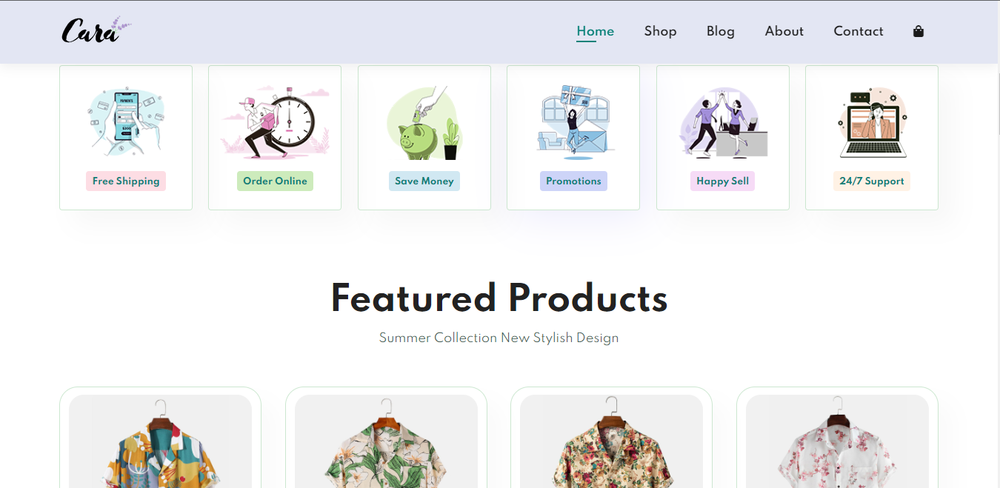

# Ecommerce-Website-With-HTML-CSS-JavaScript

This is a Fully Responsive Ecommerce Website! This platform provides an intuitive and seamless online shopping experience across all devices. 
* Whether you're browsing on a desktop, tablet, or smartphone, our website ensures that you can explore, select, and purchase products with ease. This README will guide you through the key features and technologies used to create this responsive, multipage ecommerce website.


## Intro
- This Ecommerce Website aims to provide users with a consistent and enjoyable shopping experience, regardless of the device they use. From browsing through products to making secure payments, the website offers a range of features to enhance the user experience.

## Features
  Responsive Home Page Design.
- Shop Page & Single Product Page.
- Blog Page.
- About Page.
- Contact Us.
- Ecommerce Shopping Cart.

- Modern CSS, including flexbox and CSS Grid for layout.
- Modern CSS techniques to create stunning designs and effects.
- Used common components and layout patterns for professional website design and development.
- Advanced responsive design using media queries.


## Technologies Used
* Frontend: HTML5, CSS3, JavaScript
* Authentication: JSON Web Tokens (JWT), OAuth
* Payment: Other payment gateways
* Version Control: Git, GitHub
* Deployment: Netlify

## Getting Started
Clone the repository: 
```
git clone https://github.com/Gichbuoy/Ecommerce-website.git
```

## Responsive Design
The website is designed using responsive techniques to adapt to different screen sizes. Media queries, flexible layouts, and fluid images ensure that the website looks and functions seamlessly on desktops, tablets, and smartphones.

## Contributing
I welcome contributions from the community! If you'd like to contribute to the project, please fork the repository, create a new branch, make your changes, and submit a pull request.

## License
This project is licensed under the 

### screenshot





